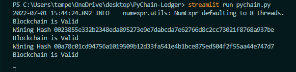
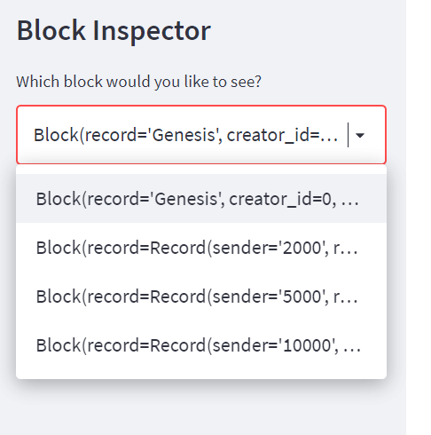
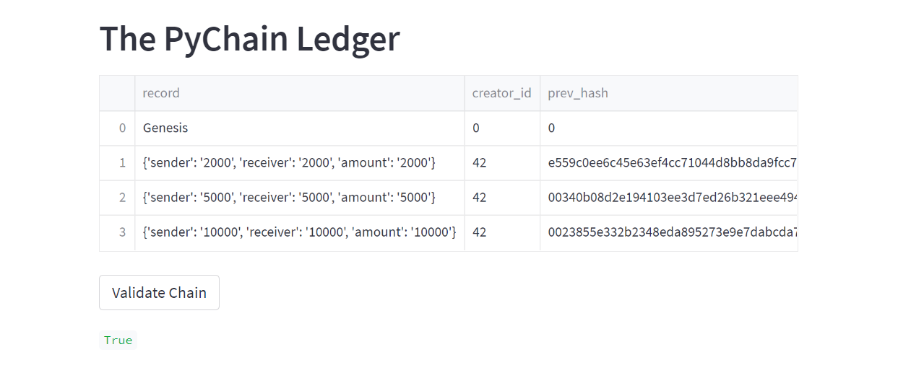

# PyChain-Ledger
I'm fintech engineer who’s working at one of the five largest banks in the world. I was recently promoted to act as the lead developer on their decentralized finance team. My task is to build a blockchain-based ledger system, complete with a user-friendly web interface. This ledger should allow partner banks to conduct financial transactions (that is, to transfer money between senders and receivers) and to verify the integrity of the data in the ledger.

# Validation Screenshots

